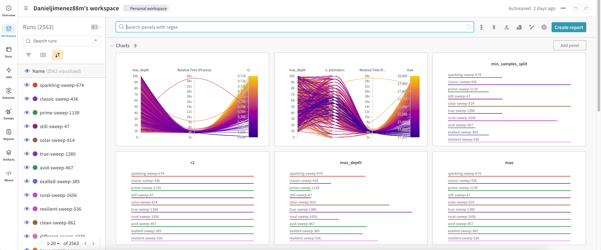
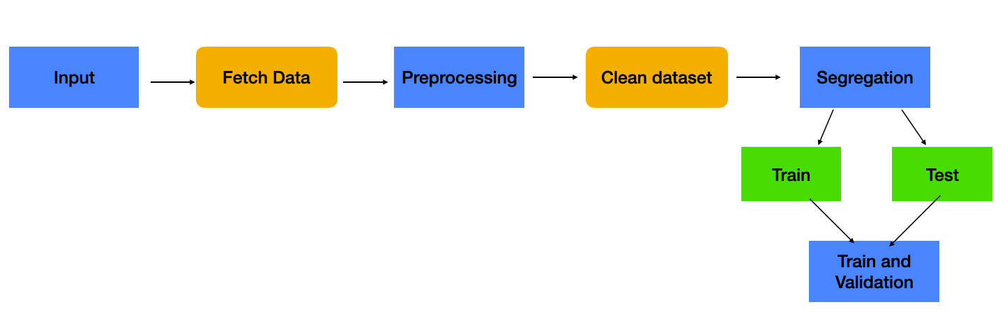

### Design Strategies for Pipelines, Focused on the Track of Machine Learning Experiments from a Software Design Perspective



This repository deals with the application of Weights and Biases for model tracking and MLflow for pipeline development.

The first highlight is that the work will be approached from the perspective of artifact development. Therefore, the scripts will be designed based on argparser functions to build a pipeline as described in the following image.



Each step in the folder 3-Pipeline contains three main files:

* Conda.yml: To create an environment for the specific process
* script.py: Contract for the phase in the pipeline
* MLproject: Pipeline manager (order controller)

### Steps for the Pipeline

1. Folder `1-Download_data`: Downloads data from a Git repository.
2. Folder `2-ETL`: Cleans titles and removes NaN values.
3. Folder `3-split_dataset`: Splits the data into train and test sets.
4. Folder `4-Training_model`: Trains the models, executing all previous steps.


### Explain this code and how to run it

```python
import mlflow
import os
import wandb
import hydra
from omegaconf import DictConfig

@hydra.main(config_name='config')
def go(config: DictConfig):
    os.environ["WANDB_PROJECT"] = config["main"]["project_name"]
    os.environ["WANDB_RUN_GROUP"] = config["main"]["experiment_name"]

    root_path = hydra.utils.get_original_cwd()

    _ = mlflow.run(
        os.path.join(root_path, "1-Download_data"),
        "main",
        parameters={
            "file_url": config["data"]["file_url"],
            "artifact_name": "pokemon.csv",
            "artifact_type": "raw_data",
            "artifact_description": "Input data"
        },
    )

    _ = mlflow.run(
        os.path.join(root_path, "2-ETL"),
        "main",
        parameters={
            "input_artifact": "pokemon.csv:latest",
            "artifact_name": "clean_data.csv",
            "artifact_type": "processed_data",
            "artifact_description": "Cleaned data"
        },
    )

    _ = mlflow.run(
        os.path.join(root_path, "3-Split_dataset"),
        "main",
        parameters={
            "input_artifact": "clean_data.csv:latest",
            "train_artifact_name": "train_data.csv",
            "test_artifact_name": "test_data.csv",
            "artifact_type": "split_data",
            "artifact_description": "Train and test split",
            "test_size": 0.2
        },
    )

    _ = mlflow.run(
        os.path.join(root_path, "4-Training_model"),
        "main",
        parameters={
            "train_artifact": "train_data.csv:latest",
            "test_artifact": "test_data.csv:latest"
        },
    )

if __name__ == "__main__":
    go()

```

This code integrates multiple tools to streamline the machine learning pipeline process. It starts by importing necessary libraries such as `mlflow` for managing the machine learning lifecycle, `os` for environment variable management, `wandb` for experiment tracking, and `hydra` for configuration management. The `go` function, decorated with `@hydra.main(config_name='config')`, sets up environment variables for Weights and Biases (W&B) based on a configuration file. It then determines the root directory of the project. The function sequentially executes four MLflow projects: `1-Download_data`, `2-ETL`, `3-Split_dataset`, and `4-Training_model`, each performing specific tasks in the pipeline. The `1-Download_data` project downloads raw data from a specified URL and stores it as `pokemon.csv`. The `2-ETL` project cleans this data and produces a processed file `clean_data.csv`. The `3-Split_dataset` project splits the cleaned data into training and testing sets, creating `train_data.csv` and `test_data.csv`. Finally, the `4-Training_model` project trains a machine learning model using these datasets. Each step's parameters, such as file paths and artifact descriptions, are specified in the configuration, ensuring reproducibility and consistency across runs. The `if __name__ == "__main__": go()` block ensures that the `go` function runs when the script is executed. This setup allows for efficient management and execution of complex machine learning workflows, leveraging the capabilities of MLflow, W&B, and Hydra for a cohesive and scalable solution.


## How to log in to Weights and Biases, its purpose as an AI tool, and how to start a project

Weights and Biases (W&B) is a tool for tracking and visualizing machine learning experiments. It helps in logging experiments, visualizing results, and sharing findings.

Login to Weights and Biases:

1. First, sign up at [Weights and Biases](https://wandb.ai/).
Install the W&B client: pip install wandb
Log in to W&B: wandb login

2. Start a Project:

Initialize a new run in the script:

```python
import wandb
wandb.init(project="project_name")

```


3. Log Metrics and Parameters:

Log metrics during training:

```python
wandb.log({"loss": loss, "accuracy": accuracy})
```

4. Register a Model:

Save and register your model:


```python
wandb.save('model.h5')
```


### How MLflow is used for pipelines

MLflow is used to manage the machine learning lifecycle, including experimentation, reproducibility, and deployment. In this example, MLflow runs specific steps in the pipeline as independent processes, each defined by a separate script and configuration.

### Hydra's role in running the config.yml
Hydra is a framework for elegantly configuring complex applications. It manages configurations and runs the main script with the specified settings from config.yml.

```yaml
main:
  project_name: Pokemon_exercise
  experiment_name: dev
data:
  file_url: https://gist.githubusercontent.com/armgilles/194bcff35001e7eb53a2a8b441e8b2c6/raw/92200bc0a673d5ce2110aaad4544ed6c4010f687/pokemon.csv

```

This configuration file sets the project name, experiment name, and data file URL. Hydra reads this file and sets the corresponding environment variables and parameters for the script to use during execution.